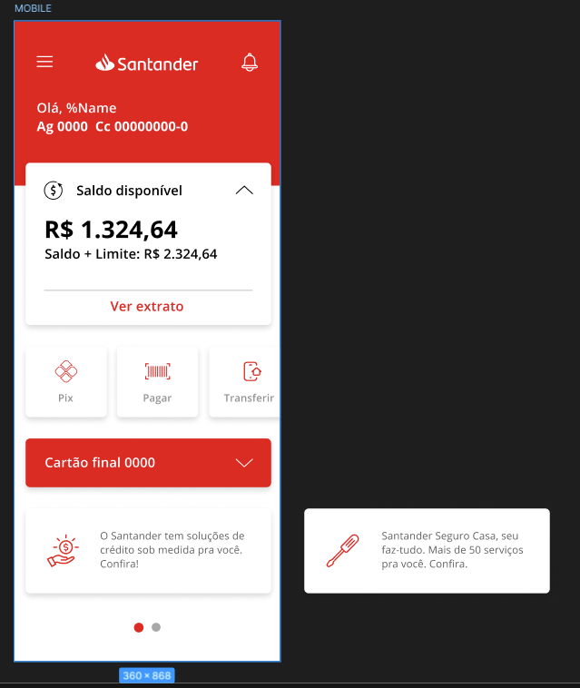
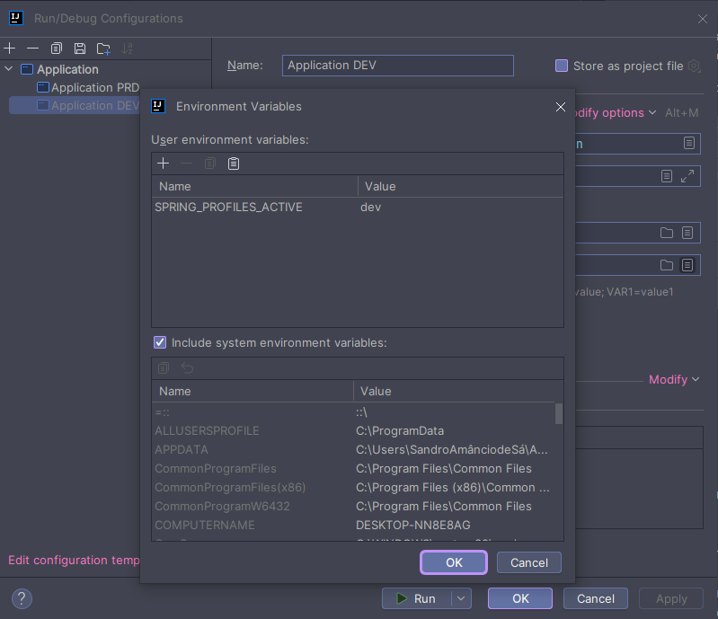
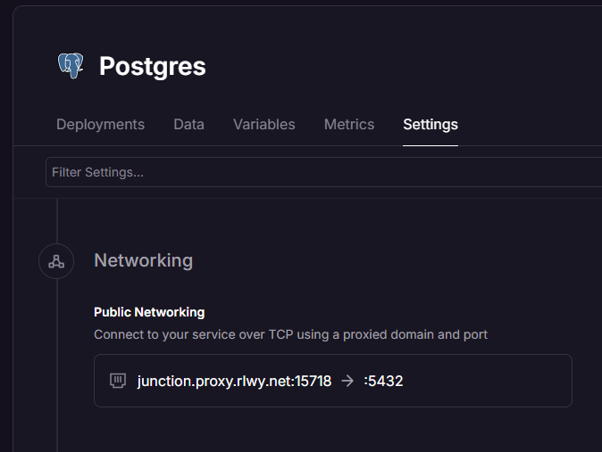
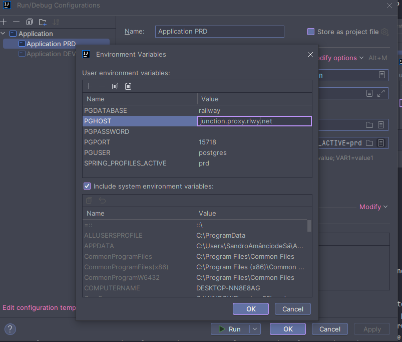

[Figma com projeto](https://www.figma.com/design/0ZsjwjsYlYd3timxqMWlbj/SANTANDER---Projeto-Web%2FMobile?node-id=1421-432&node-type=frame)



[JSON EDITOR](https://jsoneditoronline.org/)

- Extraindo dados do card

````json
{
    "name": "sandro",
    "account-number": "000000-0",
    "account-agency": "0000",
    "account-balance": 1324.64,
    "account-limit": 1000.00,

    "pix-icon": "",
    "pix-description": "",
    "pay-icon": "",
    "pay-description": "",
    "transfer-icon": "",
    "transfer-description": "",

    "card-number": "xxxx xxxx xxxx xxxx",
    "card-limit": 1000.00,

    "news-icon": "",
    "news-descripition": "noticia descrição"

  }
  
````

- Abstraindo para a POO

````json
{
    "name": "sandro",
        "account":{
            "number": "000000-0",
            "agency": "0000",
            "balance": 1324.64,
            "limit": 1000.00
        }, 
    "features":[
        {
          "icon":"url",
          "description": "Descrição do feature"
        }
    ],
    "card":{
        "number": "xxxx xxxx xxxxx xxxx",
        "limit": 1000.00
    },
    "news": [
        {
          "icon":"url",
          "description": "Descrição da noticia"
        }
    ]
}
````

### Diagrama de classe com o chat GPT 

````text
Gere um diagrama de classes(usando a sintaxe Mermaid) tendo em vista o seguinte JSON que representa um usuario de banco. Matenha uma estrutura simples e fiel ao modelo que vou passas. Mantenha os nomes em Ingles

````


Diagrama de classes usando a sintaxe Mermaid baseado no JSON fornecido pelo chat:

````mermaid
classDiagram
    class User {
        +String name
        +Account account
        +List<Feature> features
        +Card card
        +List<News> news
    }

    class Account {
        +String number
        +String agency
        +Float balance
        +Float limit
    }

    class Feature {
        +String icon
        +String description
    }

    class Card {
        +String number
        +Float limit
    }

    class News {
        +String icon
        +String description
    }

    User "1" *--> "1" Account
    User "1" *--> "N" Feature
    User "1" *--> "1" Card
    User "1" *--> "N" News
````

Esse diagrama representa a estrutura do usuário, suas contas, características, cartão e notícias, de maneira clara e organizada.

- Para ler o arquivo `resouces/application-dev.yml` criar a variavel de ambiente na IDE



- Para ler o arquivo `resouces/application-prd.yml` duplique aplication altere de `dev` para `prd`
- Crie uma conta no [Railway](https://railway.app/)
- Em seguida crie um no projeto escolhendo ``Deploy PostegresSQL``
- OBS: para acessar o banco de dados localmente acesse Settings para copiar a url publica

- As demais variaveis estão em variables copie e crie as variaveis de produção na IDE



````yml
    spring:
    datasource:
    url: jdbc:postgresql://${PGHOST}:${PGPORT}/${PGDATABASE}
    username: ${PGUSER}
    password: ${PGPASSWORD}
    jpa:
    open-in-view: false
    hibernate:
    ddl-auto: create
````

